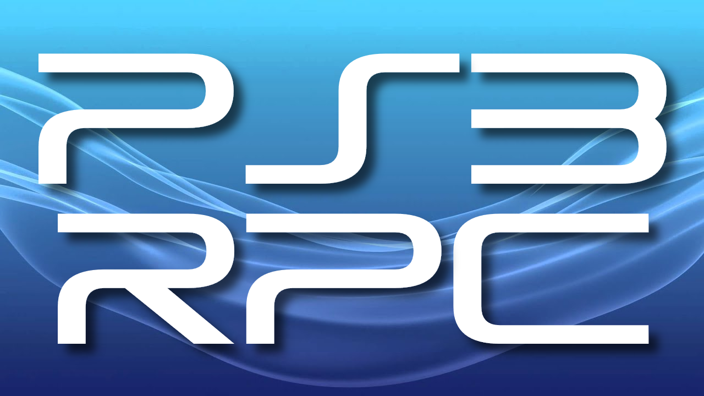

# PlayStation 3 Rich Presence

  

## About

This is a Discord Rich Presence application for PlayStation 3 developed in C#/Windows Forms.

## Prerequisites

* Both PC and PS3 connected to the same network
* PS3 sytem with either [HEN](https://www.psx-place.com/threads/ps3hen-v3-3-0-4-91-support-official-release-thread-homebrew-enabler-for-the-ps3.23955/) or CFW
* [webMAN MOD](https://github.com/aldostools/webMAN-MOD/releases)
* Your PS3's local IP address (192.168.1.xxx)

## Setup

1. Head over to the [Discord developer portal](https://discord.com/developers/docs/intro) and create an application (the name set will be the title in Discord e.g. PS3). Note down the `Application ID`
2. Verify the webMAN MOD server by entering the PS3 local IP address in browser
3. Open `PS3RPC.exe` and in the config menu enter your `Application ID` and click save
4. Enter the PS3 local IP address and click attach

By default you should receive a popup message on your PS3, this can be disabled in the config menu

## FAQ

* Why won't it connect to my PS3?
    * Make sure you have webman installed and can access the built in website, if you can and it still doesn't work please open a pull request
* Why doesn't the artwork show for the game I'm playing? / Why does the incorrect artwork show?
    * The databases I used are not 100% reliable, and I am not really able to combine them to cover every game. You can manually add your own entry in assets/db.json by following the accompanying example file
* I want my own software to show up, how do I do that?
    * See the above answer, as long as your application has a detectable title ID it will work

## Credit

* [DiscordRichPresence](https://github.com/Lachee/discord-rpc-csharp) by Lachee
* [RacMAN source code](https://github.com/MichaelRelaxen/racman) for reference
* [GameTDB](https://gametdb.com)
* [IGDB API](https://igdb.com)

## License

This software is licensed under the MIT license.
